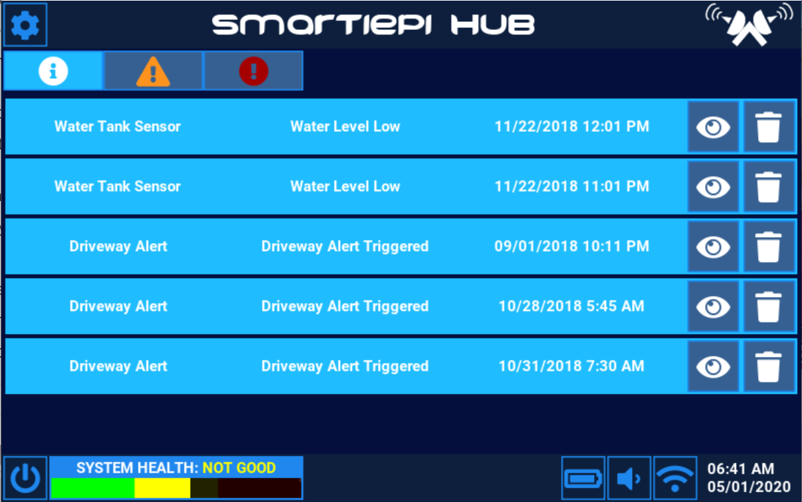

# SmartiePiHubUI
A program which utilizes python and the kivy language and runs on the raspberry pi. This program provides a user interface for the Smartie Pi Hub.

To activate the virtual environment in windows cmd type "kivy_venv\Scripts\activate"

